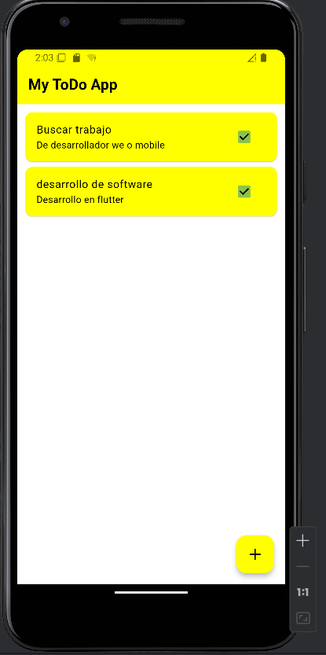
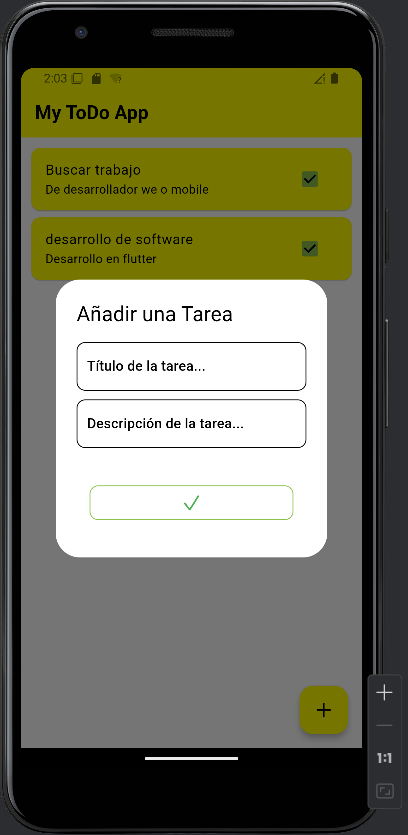
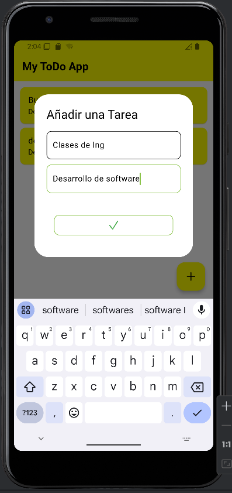
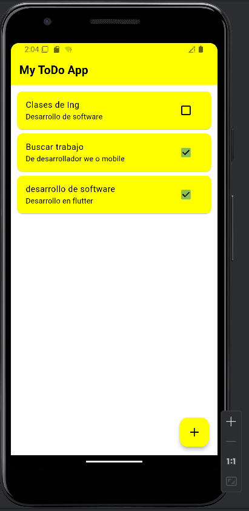
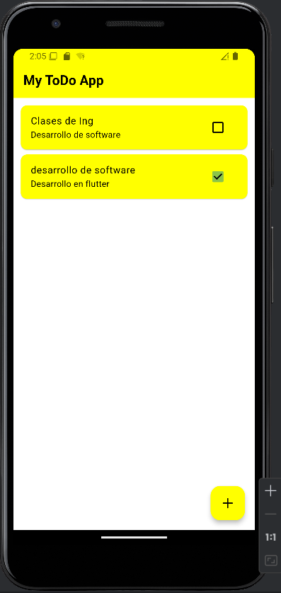

# Flutter Todo Clean

Una aplicación de Todo List implementada en Flutter siguiendo los principios de Clean Architecture y utilizando el patrón BLoC para la gestión del estado.

## 📱 Características

- Crear, editar y eliminar tareas
- Marcar tareas como completadas
- Persistencia de datos local
- Interfaz de usuario limpia y moderna
- Gestión de estado reactiva con BLoC
- Arquitectura limpia y mantenible

## 🏗️ Arquitectura

El proyecto sigue una arquitectura limpia con la siguiente estructura:

```
lib/
├── data/
│   └── todo.dart              # Modelo de datos Todo
│
├── todo_bloc/
│   ├── todo_bloc.dart         # Implementación del BLoC
│   ├── todo_event.dart        # Eventos del BLoC
│   └── todo_state.dart        # Estados del BLoC
│
├── home.dart                  # Pantalla principal
├── main.dart                  # Punto de entrada
└── simple_bloc_observer.dart  # Observer para debugging
```

### Capas de la Aplicación

1. **Capa de Datos (data/)**
    - `todo.dart`: Define el modelo de datos Todo con serialización JSON
    - Manejo de persistencia local

2. **Capa de Estado (todo_bloc/)**
    - Implementación del patrón BLoC
    - Manejo de eventos y estados
    - Lógica de negocio principal

3. **Capa de Presentación**
    - `home.dart`: UI principal de la aplicación
    - Widgets y componentes visuales

## 🛠️ Tecnologías Utilizadas

- Flutter
- flutter_bloc: ^8.1.4
- hydrated_bloc: ^9.1.4
- equatable: ^2.0.5
- path_provider: ^2.1.2

## 🚀 Instalación

1. **Clonar el repositorio**
```bash
git clone https://github.com/tu-usuario/flutter_todo_clean.git
cd flutter_todo_clean
```

2. **Instalar dependencias**
```bash
flutter pub get
```

3. **Ejecutar la aplicación**
```bash
flutter run
```

## 📝 Uso

### Crear una nueva tarea
1. Presiona el botón flotante (+)
2. Ingresa el título y subtítulo de la tarea
3. Confirma para crear la tarea

### Editar una tarea
1. Presiona prolongadamente sobre la tarea
2. Modifica los campos necesarios
3. Guarda los cambios

### Completar una tarea
- Toca el checkbox junto a la tarea para marcarla como completada

### Eliminar una tarea
- Desliza la tarea hacia un lado para eliminarla

## 🧪 Testing

Para ejecutar las pruebas:
```bash
flutter test
```

## 📦 Estado Management

La aplicación utiliza el patrón BLoC para la gestión del estado con las siguientes características:

- **HydratedBloc**: Persistencia automática del estado
- **SimpleBlocObserver**: Logging y debugging de estados
- **Eventos principales**:
    - TodoStarted
    - TodoAdded
    - TodoDeleted
    - TodoUpdated
    - TodoToggled

## 🎨 Temas y Estilo

La aplicación utiliza un tema personalizado con:
- Esquema de colores claro
- Énfasis en accesibilidad
- Diseño material consistente

```dart
ColorScheme.light(
  surface: Colors.white,
  onSurface: Colors.black,
  primary: Colors.yellowAccent,
  onPrimary: Colors.black,
  secondary: Colors.lightGreen,
  onSecondary: Colors.white,
)
```

## 🤝 Contribuir

1. Fork el proyecto
2. Crea tu rama de características
   ```bash
   git checkout -b feature/AmazingFeature
   ```
3. Commit tus cambios
   ```bash
   git commit -m 'Add some AmazingFeature'
   ```
4. Push a la rama
   ```bash
   git push origin feature/AmazingFeature
   ```
5. Abre un Pull Request

## 📄 Licencia

Este proyecto está bajo la Licencia MIT - ver el archivo [LICENSE.md](LICENSE.md) para detalles

## 👥 Autores

- **[Tu Nombre]** - *Trabajo Inicial* - [TuUsuario](https://github.com/TuUsuario)

## 🙏 Agradecimientos

- Flutter Team
- Bloc Library Contributors
- [Otros agradecimientos...]

## 🙏 Capturas de Pantalla






